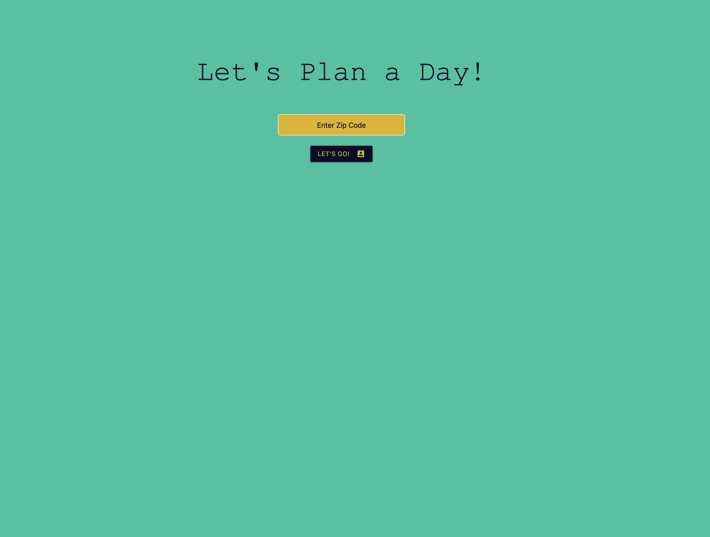
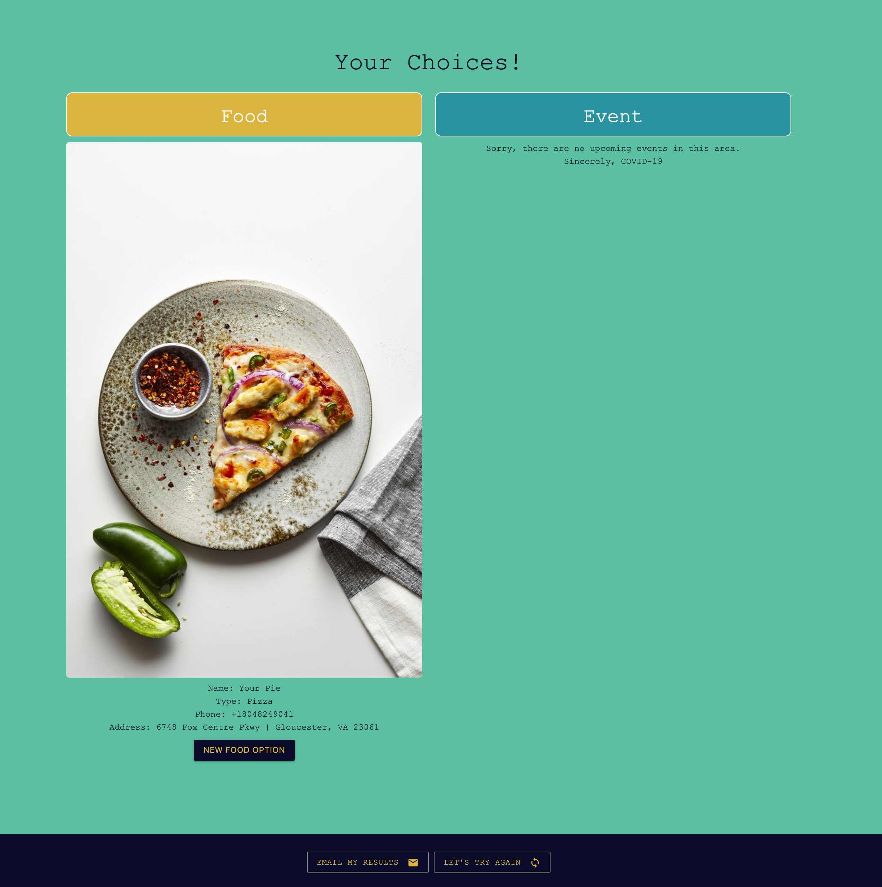
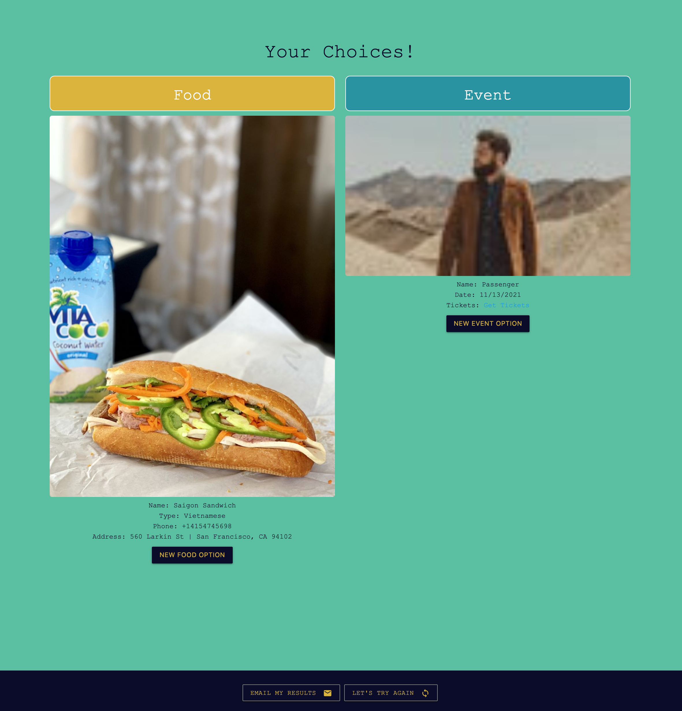
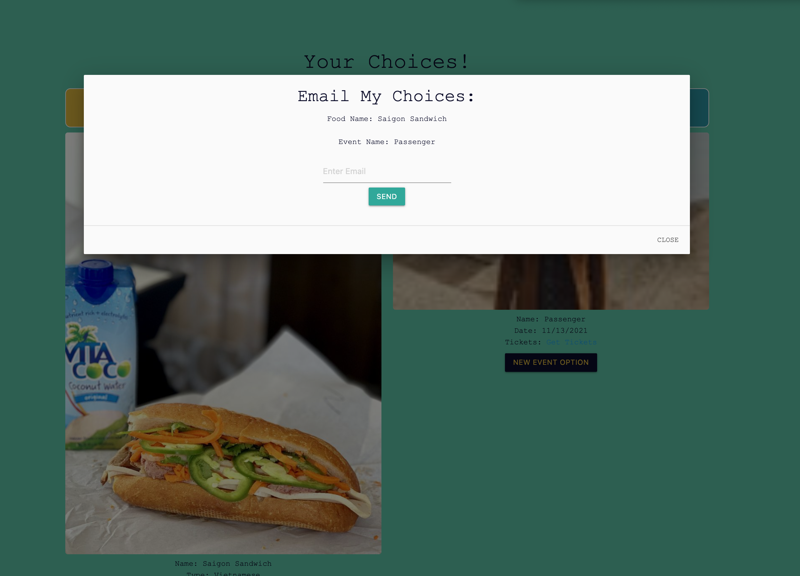

# Let's Plan a Day
JHU Coding Bootcamp-Project 1 (Anthony, Jackie, Kyle, Nick)
# Description
- The concept for Let’s Plan A Day App is to help users connect to random events and locations based off user's zip code, Users can refresh results until satisfied. Users can email event/restaurant details to specifed recipient.
# Technologies:
- HTML5
- CSS
- Javascript
- jQuery
- Materialize CSS
- Yelp (API)
- Ticket Master (API)
# Screenshots
- Home page
 
- Results Page
 
  
- Email Results
 
# Links
### Link to GitHub
- https://github.com/nvandenberge/Project-1
### Link to Application
- https://nvandenberge.github.io/Project-1/